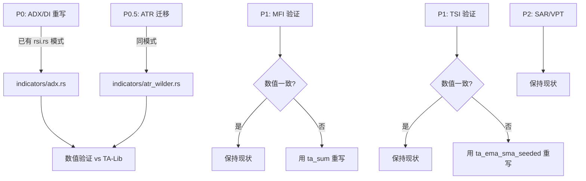

# DI/ADX/SAR/TSI/VPT/MFI 算子迁移分析报告

## 1. 问题本质

`rust_ti` 库的多个指标实现使用了 **SMA (Simple Moving Average)** 平滑，而行业标准 **TA-Lib / TradingView / Bloomberg** 使用 **Wilder 平滑** (α=1/N)。这导致计算结果与 Python 端 `ta-lib` 不一致。

> [!IMPORTANT]
> py-alpha-lib 的 **现有算子已完全覆盖所有需求**，不需要新增任何算子。

---

## 2. 逐指标分析

### 🔴 P0: +DI / -DI / ADX / ADXR — 必须修复

**问题根源**: `rust_ti::directional_movement_system` 有**两层**算法错误：

```
┌─────────────────────────────────────────────────────────────────┐
│              rust_ti 实现 (错误)          │   TA-Lib 标准 (正确)  │
├─────────────────────────────────────────────────────────────────┤
│ DI层:                                    │                      │
│   sum(+DM[i-N..i]) / sum(TR[i-N..i])     │   wilder(+DM) /      │
│   → 简单窗口滑动求和                       │   wilder(TR) * 100   │
│                                          │   → Wilder 递推平滑   │
├─────────────────────────────────────────────────────────────────┤
│ ADX层:                                   │                      │
│   SMA(DX, N)                             │   Wilder_smooth(DX)  │
│   → 简单移动平均                           │   → Wilder 递推平滑   │
└─────────────────────────────────────────────────────────────────┘
```

**TA-Lib 标准 ADX 算法**:
```
1. +DM[i] = max(high[i]-high[i-1], 0) if > max(low[i-1]-low[i], 0), else 0
2. -DM[i] = max(low[i-1]-low[i], 0)   if > max(high[i]-high[i-1], 0), else 0
3. TR[i]  = max(high[i]-low[i], |high[i]-close[i-1]|, |low[i]-close[i-1]|)
4. smoothed_+DM = ta_wilder_smooth(+DM, N)       ← α = 1/N, SMA seed
5. smoothed_-DM = ta_wilder_smooth(-DM, N)
6. smoothed_TR  = ta_wilder_smooth(TR, N)
7. +DI = smoothed_+DM / smoothed_TR * 100
8. -DI = smoothed_-DM / smoothed_TR * 100
9. DX  = |+DI - -DI| / (+DI + -DI) * 100
10. ADX = ta_wilder_smooth(DX, N)                ← 第二层 Wilder 平滑
11. ADXR[i] = (ADX[i] + ADX[i-N]) / 2
```

**所需算子**: `ta_wilder_smooth` ✅ 已存在 | `ta_ref` ✅ 已存在 (用于 ADXR 延迟取值)

**迁移方案**: 在 `indicators-computation/src/indicators/` 新建 `adx.rs`，参照 `rsi.rs` 模式：
- 手动逐元素计算 +DM, -DM, TR（无需窗口算子）
- 用 `ta_wilder_smooth` 分别平滑三者
- 构造 DI → DX → ADX → ADXR

---

### 🟡 P1a: MFI — 需要验证

**当前实现**: `rust_ti::money_flow_index`

```rust
// rust_ti 的分类逻辑 (可能有问题):
if raw_money_flow[i] > raw_money_flow[i-1]  // 比较 TP*Vol 的变化
    → positive_money_flow += raw_money_flow[i];

// TA-Lib 标准分类逻辑:
if TP[i] > TP[i-1]                           // 比较 TP 本身的变化
    → positive_money_flow += TP[i] * volume[i];
```

**差异影响**: 当 TP 上涨但 Volume 下降导致 TP×Vol 反而下降时，两者分类方向相反。

**所需算子**: `ta_sum` ✅ 已存在（滚动窗口求和正/负 money flow）

**方案**: 先做数值对比验证。若不一致，用 alpha 算子 `ta_sum` 重写。

---

### 🟡 P1b: TSI — 需要验证

**当前实现**: `rust_ti::true_strength_index` + EMA

```
TSI = double_EMA(momentum) / double_EMA(|momentum|) × 100
```

**潜在问题**: rust_ti 的 EMA 使用 **first-value seed**，而 TA-Lib 使用 **SMA seed**。差异通常只影响初始几个 bar，但在短序列上可能显著。

**所需算子**: `ta_ema_sma_seeded` ✅ 已存在

**方案**: 数值对比验证。若需严格一致，用 `ta_ema_sma_seeded` 重写双层 EMA。

---

### 🟢 P2: SAR — 无需修改

**原因**: Parabolic SAR 是**纯递推指标**，不涉及任何 MA/平滑选择：

```
SAR[i] = SAR[i-1] + AF × (EP - SAR[i-1])
```

AF（加速因子）从 af_start 线性递增到 af_max，与 SMA/Wilder 无关。

> [!NOTE]
> rust_ti 的 SAR 实现有一个 `acceleration_factor_max - 0.0000001` 的浮点精度 hack，
> 可能导致极端情况下与 TA-Lib 有微小差异，但核心算法正确。

---

### 🟢 P2: VPT — 无需修改

**原因**: Volume Price Trend 是**纯累加公式**：

```
VPT[i] = VPT[i-1] + volume[i] × (close[i] - close[i-1]) / close[i-1]
```

不涉及任何 MA/平滑操作，rust_ti 实现与标准一致。

---

## 3. py-alpha-lib 算子覆盖矩阵

| 指标 | 需要的算子 | py-alpha-lib 状态 | 需要新增？ |
|------|-----------|-------------------|-----------|
| **+DI/-DI** | `ta_wilder_smooth` | ✅ `ext_ema.rs` L40 | ❌ |
| **ADX** | `ta_wilder_smooth` | ✅ `ext_ema.rs` L40 | ❌ |
| **ADXR** | `ta_ref` (延迟取值) | ✅ `series.rs` L11 | ❌ |
| **MFI** (如需重写) | `ta_sum` | ✅ `sum.rs` L13 | ❌ |
| **TSI** (如需重写) | `ta_ema_sma_seeded` | ✅ `ext_ema.rs` L19 | ❌ |
| **SAR** | 无需算子 | N/A | N/A |
| **VPT** | 无需算子 | N/A | N/A |

> [!TIP]
> **结论：py-alpha-lib 不需要扩展任何算子。** 所有计算需求均可由现有算子覆盖。

---

## 4. ATR 的同类问题

> [!WARNING]
> `rti/core/other.rs` 的 `average_true_range` 也使用了 `SimpleMovingAverage`：
> ```rust
> rust_ti::other_indicators::bulk::average_true_range(
>     close, high, low,
>     rust_ti::ConstantModelType::SimpleMovingAverage,  // ← 应该用 Wilder
>     period,
> )
> ```
> 如果 ML features 中使用了这个 ATR，它也存在与 TA-Lib 不一致的问题。
> 建议一并迁移为 `ta_wilder_smooth(TR, period)`。

---

## 5. 推荐实施路线



### 实施步骤

1. **P0 — ADX/DI 重写** (~2-3h)
   - 新建 `indicators/adx.rs`
   - 实现 `compute_adx(high, low, close, period) → (pdi, mdi, adx, adxr)`
   - 内联计算 +DM/-DM/TR + 3x `ta_wilder_smooth` + DX + `ta_wilder_smooth`
   - 修改 `ml_features/technical.rs::compute_directional_movement_features` 调用新实现

2. **P0.5 — ATR 迁移** (~1h)
   - 新建 `indicators/atr.rs`
   - TR 手动计算 + `ta_wilder_smooth`

3. **P1 — MFI/TSI 数值验证** (~1h)
   - 跑对比测试，确认是否需要迁移

4. **P2 — SAR/VPT** — 无需操作

---

## 6. 代码参考

ADX 重写的骨架代码（参照 `indicators/rsi.rs` 模式）:

```rust
use alpha::algo::{ta_wilder_smooth, Context};

const FLAG_STRICTLY_CYCLE: u64 = 2;

pub fn compute_adx(
    high: &[f64], low: &[f64], close: &[f64], period: usize
) -> (Vec<f64>, Vec<f64>, Vec<f64>, Vec<f64>) {
    let len = high.len();
    let nan_vec = || vec![f64::NAN; len];
    
    // 1. 计算 +DM, -DM, TR (逐元素)
    let mut pdm = vec![0.0f64; len];
    let mut mdm = vec![0.0f64; len];
    let mut tr  = vec![0.0f64; len];
    pdm[0] = f64::NAN;
    mdm[0] = f64::NAN;
    tr[0]  = f64::NAN;
    
    for i in 1..len {
        let h_diff = high[i] - high[i-1];
        let l_diff = low[i-1] - low[i];
        pdm[i] = if h_diff > 0.0 && h_diff > l_diff { h_diff } else { 0.0 };
        mdm[i] = if l_diff > 0.0 && l_diff > h_diff { l_diff } else { 0.0 };
        tr[i] = (high[i] - low[i])
            .max((high[i] - close[i-1]).abs())
            .max((low[i] - close[i-1]).abs());
    }
    
    // 2. Wilder 平滑 (从 index 1 开始的有效数据)
    let ctx = Context::new(0, 0, FLAG_STRICTLY_CYCLE);
    let mut sm_pdm = vec![0.0; len]; // smoothed +DM
    let mut sm_mdm = vec![0.0; len];
    let mut sm_tr  = vec![0.0; len];
    let _ = ta_wilder_smooth(&ctx, &mut sm_pdm, &pdm, period);
    let _ = ta_wilder_smooth(&ctx, &mut sm_mdm, &mdm, period);
    let _ = ta_wilder_smooth(&ctx, &mut sm_tr,  &tr,  period);
    
    // 3. +DI, -DI, DX
    let mut pdi = nan_vec();
    let mut mdi = nan_vec();
    let mut dx  = vec![f64::NAN; len];
    for i in 0..len {
        if sm_tr[i].is_finite() && sm_tr[i] > 0.0 {
            pdi[i] = sm_pdm[i] / sm_tr[i] * 100.0;
            mdi[i] = sm_mdm[i] / sm_tr[i] * 100.0;
            let di_sum = pdi[i] + mdi[i];
            dx[i] = if di_sum > 0.0 {
                (pdi[i] - mdi[i]).abs() / di_sum * 100.0
            } else { 0.0 };
        }
    }
    
    // 4. ADX = Wilder_smooth(DX, period)
    let mut adx = vec![0.0; len];
    let _ = ta_wilder_smooth(&ctx, &mut adx, &dx, period);
    
    // 5. ADXR = (ADX[i] + ADX[i-period]) / 2
    let mut adxr = nan_vec();
    for i in period..len {
        if adx[i].is_finite() && adx[i-period].is_finite() {
            adxr[i] = (adx[i] + adx[i-period]) / 2.0;
        }
    }
    
    (pdi, mdi, adx, adxr)
}
```
